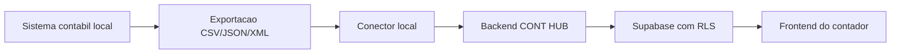

# Arquitetura de Conector Local

## Quando usar

Use conector local quando o sistema contabil do contador estiver instalado em computador/servidor local e nao tiver API web oficial.

## Modelo recomendado

1. O contador instala um pequeno agente local.
2. O agente le arquivos exportados pelo sistema contabil ou consome uma API local documentada.
3. O agente envia os dados para o backend fiscal/contabil do CONT HUB usando HTTPS.
4. O backend valida, normaliza, grava historico e aplica RLS por `organization_id`.

## O que o agente local nao deve fazer

- Nao acessar banco de dados de terceiros sem contrato e documentacao.
- Nao capturar senha de usuario do sistema contabil.
- Nao enviar dados direto para o Supabase usando service role.
- Nao misturar dados de escritorios diferentes.

## Fluxo de sincronizacao

## Campos minimos do payload

- `organizationId`
- `clientId` ou CNPJ para reconciliacao
- `provider`
- `recordType`
- `externalId`
- `competence`
- Dados especificos do registro importado

## Controle operacional

- Toda sincronizacao deve criar registro em `accounting_sync_runs`.
- Erros devem ir para `accounting_sync_errors`.
- Importacoes com arquivo devem passar por previa antes da confirmacao.
- Alteracoes relevantes devem gerar auditoria em `accounting_audit_logs`.
